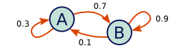
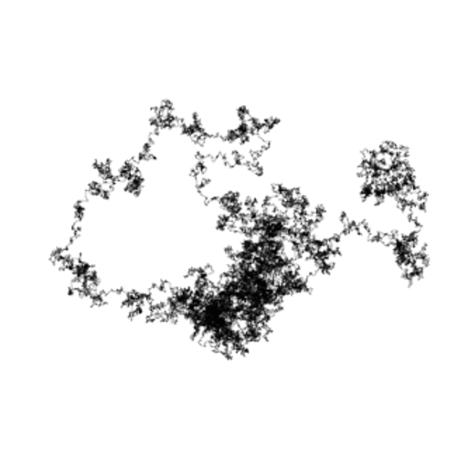

ofxMarkovChain
=======

Introduction
------------

This is a simple openFrameworks addon for generating random states using a Markov chain. The transition matrix can be set programmatically or with a text file.

Usage
-----

Create a transition matrix from a file:

	ofxMC::Matrix mat("transitionMatrix.txt");

Setup the Markov chain with the loaded matrix, in state 0:

	ofxMC::MarkovChain markov;
    markov.setup(mat, 0);

Update the state of the Markov chain:

	markov.update();

You can get the state of the Markov chain like this:

	markov.getState();

It will return an `int` representing the state of the Markov chain, starting at 0.

You can draw the Markov chain with the `draw()` method.

Examples
--------

The example `example-rainfall` depends on the ofxGui addon to work.
The example `example-random_walker` has no dependency (except ofxMarkovChain of course).

	
	<em>Random walker example</em>

Compatibility
-------------
This addon was tested with Linux and openFrameworks v0.8.3
db - This addon was tested with Mac OSX and openFrameworks v0.11.0
